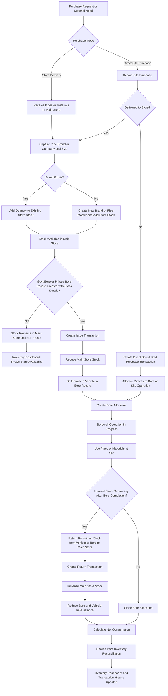

# Inventory Module Redesign

## 1. Purpose of the Redesign

The inventory module should be redesigned as an operations-linked stock control system, not only as a manual stock entry page.

The redesigned module must support:

- central store room inventory tracking
- borewell-linked stock issue and stock return
- direct site purchase handling
- accurate stock balance for pipes, spare parts, diesel, and other drilling materials
- transaction-based stock movement history
- automatic stock updates connected to Government and Private Bore workflows

The key design goal is:

**every stock change must happen through a transaction event**

This prevents manual stock inconsistencies, duplicate counting, and unclear stock movement history.

---

## 2. Core Design Principle

The inventory system should follow a **master + stock + transaction ledger** structure.

### Recommended concept

For every inventory item:

- one master record defines what the item is
- one current stock record represents present available quantity in the store
- many transaction records capture movement history

This means:

- current stock is the latest operational balance
- transaction history is the audit trail
- all issue, purchase, return, adjustment, and consumption events are traceable

---

## 3. Inventory Categories

The system should support four practical inventory groups:

### A. Pipes
Track:
- company
- size
- material
- quality or grade
- standard length
- unit
- cost per unit
- reorder level

### B. Spare Parts
Track:
- spare name or number
- category
- brand
- specification
- unit type
- cost per unit
- reorder level

### C. Diesel
Track:
- purchase quantity
- amount
- supplier or bill reference
- storage location
- issue or consumption against vehicle and bore

### D. Other Drilling Materials
Track flexible materials such as:
- clamps
- welding rods
- adapters
- rope
- drilling chemicals
- cutters
- temporary consumables

These should follow the same transaction pattern as other items.

---

## 4. Dynamic Pipe Company Design

## Rule
Pipe companies must never be hardcoded.

### Reason
Supply changes based on dealers, locality, and market availability.

### Required behavior
- pipe company names must be user-driven
- users should be able to create a new company during stock purchase or item creation
- the system should reuse existing company names when available
- new names must be accepted without schema changes

### Clarification: Company is not the same as dealer
The pipe **company / brand** and the **dealer / purchase source** must be stored separately.

Example:
- Pipe company or brand = JMJ, Sudhar, Nandi, or any future brand
- Dealer or source = local shop, online seller, offline market supplier, or unknown source

This means the inventory stock should be maintained based on:
- pipe company or brand
- size
- material or specification if used

And the purchase transaction should separately capture:
- dealer name if known
- purchase mode: offline / online / local / unknown

So even if the dealer changes every time, stock should still accumulate correctly under the same pipe company and size.

### Recommended structure
Use a **dynamic pipe company master** table or reference entity.

### Process logic
- while creating a new pipe item, user can select an existing company or type a new one
- if the name does not exist, create a company record automatically
- pipe items reference this company dynamically
- dealer details should be captured only in the purchase transaction, not used as the pipe identity

### Accuracy rule
The company should be stored as a structured master reference rather than repeated free text everywhere.

This improves:
- filtering
- reporting
- spelling consistency
- dealer and brand analytics

It also ensures that:
- JMJ pipes purchased from multiple dealers still update the same JMJ stock bucket
- newly purchased pipes from a new brand create a new maintainable inventory record without changing the design

---

## 5. Real-World Stock Flow Model

The stock system must support two purchase paths.

### Scenario 1: Store Purchase
Flow:
1. purchase from dealer
2. items arrive in store room
3. stock increases in main inventory
4. purchase transaction is recorded

### Clarified rule for store stock
If pipes or materials are **not linked to any Government Bore or Private Bore record**, they are considered **available in the store room**.

That means the default inventory state is:
- not in use
- physically in store room
- available for future bore allocation

### Scenario 2: Direct Site Purchase
Flow:
1. purchase happens near borewell location
2. material may go directly to the site
3. stock may skip physical store entry
4. transaction must still be recorded for cost and usage visibility

### Recommended handling
Direct site purchase should be treated as a valid transaction path.

Two supported methods:

#### Method A: Site Purchase and Immediate Issue
- create purchase transaction with source = site purchase
- create immediate issue transaction linked to bore
- optionally avoid increasing store available balance if material never entered store

#### Method B: Virtual Store Entry then Issue
- purchase transaction increases stock into a temporary operational location
- issue transaction deducts from that location to bore

### Recommended choice
Use **location-aware transactions** with clear source and destination. That gives correct accounting without forcing fake store entry.

---

## 6. Recommended Inventory Workflow

## Stage 1: Purchase / Receive Stock
This represents incoming stock.

### Transaction types
- Purchase
- Opening stock
- Manual stock correction increase

### Data to capture
- item
- category
- quantity
- unit
- rate
- total amount
- vendor or dealer
- pipe company or brand
- purchase mode: store purchase or site purchase
- destination location
- bill reference
- purchase date
- remarks

### Effect on stock
- if destination is store: available store stock increases
- if destination is site or bore-linked operational stock: stock moves to that context instead

### Pipe purchase rule
If purchased pipes are delivered to the store room, the inventory page must update stock based on:
- company or brand
- size
- material or pipe specification if applicable

If the company already exists, quantity should be added to the existing stock record.

If the company is new, the system should:
1. create the new company or brand reference
2. create the new pipe master combination if needed
3. add the quantity into store stock

---

## Stage 2: Issue Stock to Borewell
This represents material leaving store for an operation.

### Transaction types
- Issue to Govt Bore
- Issue to Private Bore
- Transfer to vehicle
- Diesel issue or diesel consumption allocation

### Data to capture
- bore type
- bore id
- vehicle
- supervisor
- issue date
- quantity
- issuing location
- receiving operational context
- remarks

### Effect on stock
- main store stock decreases
- bore-linked issued quantity increases in operational records

### Clarified operational rule
When a new record is created in either:
- Government Bores, or
- Private Bores

and that record includes pipe allocation or material usage, the stock should move from:

- **Main Store**

to:

- **the vehicle recorded in that bore record**

This should be treated as a structured inventory movement, not as a manual assumption.

So the practical movement is:
1. stock exists in store room while not linked to any bore
2. new bore record is created
3. selected stock is assigned to that bore
4. stock shifts from store room to the respective vehicle or bore operation context
5. the inventory module marks that quantity as in use

### Important business rule
Issue should be linked to a **bore operation context**, not only to a vehicle.

Reason:
- vehicles may work across multiple bores
- inventory accountability belongs to the bore job
- reporting should show what was issued to which bore

### Recommended event trigger
The inventory movement should be triggered from the bore workflow itself.

If a Govt Bore or Private Bore record is newly created and pipe quantities are entered there, the system should automatically create:
- an issue transaction
- a vehicle allocation record
- a bore allocation record

This makes the bore record the operational source of truth.

---

## Stage 3: Borewell Usage Tracking
Once the job is active, issued stock can have three outcomes:

1. fully consumed
2. partially consumed and partially returned
3. unused and fully returned

### Recommended design
The system should not directly guess consumption from issue.

Instead:
- issue records what left the store
- return records what came back
- net usage is calculated as:

**Net Consumption = Issued Quantity - Returned Quantity - Cancelled Quantity**

This is important for pipes, spare parts, and other materials.

For diesel, actual consumption may also be recorded separately from purchase if operational logging is needed.

---

## Stage 4: Return Remaining Stock
After bore completion:

- unused pipes are returned
- unused spare items are returned
- reusable materials are returned

### Transaction types
- Return from Govt Bore
- Return from Private Bore
- Vehicle return to store

### Data to capture
- bore id
- bore type
- quantity returned
- return date
- condition
- receiving location
- remarks

### Effect on stock
- store stock increases
- bore-issued balance decreases

### Recommended rule
Return should be allowed only against previously issued quantity.

This prevents:
- false return entries
- stock inflation
- returning more than what was issued

---

## 7. Unified Inventory Transaction Model

A single transaction framework should exist for all inventory items.

## Recommended transaction entity
Each transaction should capture:

- transaction id
- item id
- item category
- transaction type
- quantity
- unit
- source location
- destination location
- bore type
- bore id
- vehicle id or vehicle name
- supervisor or issued by
- purchase reference
- vendor or supplier
- rate
- total value
- remarks
- created by
- created at

## Recommended transaction types
- Opening Stock
- Purchase
- Site Purchase
- Issue
- Return
- Transfer
- Consumption
- Adjustment Increase
- Adjustment Decrease
- Scrap or Damage

## Why this model is best
It creates one consistent ledger for:
- pipes
- spare parts
- diesel
- all future inventory items

This keeps the system extensible.

---

## 8. Recommended Database Structure

## A. Item Master
A generic or semi-generic item master should define the item.

### Fields
- item id
- item code
- item name
- item category
- subcategory
- unit
- specification
- brand or company reference
- size
- material
- quality
- standard length
- cost per unit
- reorder level
- active flag

### Note
For pipes, item uniqueness should be based on the practical combination:

- company
- size
- material
- quality
- standard length

This prevents duplicate pipe records.

---

## B. Item Company or Brand Master
Needed especially for dynamic pipe companies.
- purchase channel or source mode

### Fields
- company id
- company name
- item category applicability
- active flag

This can also support spare brands later.

## C. Supplier or Dealer Reference
This should be separate from the item company or brand master.

### Fields
- supplier id
- supplier name
- supplier type: offline / online / local / unknown
- contact details if available
- active flag

### Why needed
This separation avoids mixing:
- what the pipe **is** = company or brand
- where the pipe was **purchased from** = dealer or supplier

This is important because the same JMJ pipe may be bought from many different dealers.

## D. Inventory Stock Balance
Represents current available stock by location.

### Fields
- stock id
- item id
- location id
- available quantity
- reserved quantity if needed
- last updated

### Important design choice
Stock should be location-based, not globally stored in one number.

This is required because stock can exist in:
- main store
- vehicle
- temporary site location
- direct site purchase holding

### Clarified meaning of stock location
- If stock is not attached to a Govt Bore or Private Bore allocation, it belongs to **Main Store**
- If stock is attached to an active Govt Bore or Private Bore and loaded in a vehicle, it belongs to **Vehicle Stock / Bore Allocation**

## E. Inventory Transactions
Central movement ledger.

### Fields
- transaction id
- item id
- quantity
- transaction type
- source location
- destination location
- bore id
- bore type
- operation batch id
- issue note number
- return note number
- rate
- total amount
- supplier
- bill number
- remarks
- created by
- timestamps

## F. Bore Inventory Allocation
Recommended additional structure.

This tracks what has been issued to a bore and what remains open.

### Fields
- allocation id
- bore type
- bore id
- item id
- total issued quantity
- total returned quantity
- net consumed quantity
- status: open or closed

### Why this is useful
It simplifies:
- bore-level inventory reporting
- return validation
- final consumption summary
- closing stock settlement for a bore

### Clarified role in your workflow
This table is the key to deciding whether pipes are:
- in store room, or
- already in use

Rule:
- no open allocation = stock is in store room
- open allocation against a Govt Bore or Private Bore = stock is in use
- if vehicle is present in the bore record, that allocated stock is treated as vehicle-held stock

## G. Inventory Locations
Required for accurate stock flow.

### Recommended locations
- Main Store
- Vehicle Stock
- Site Holding
- Direct Site Purchase
- Scrap

### Why needed
Without location tracking, direct site purchase and vehicle-loaded stock become difficult to manage correctly.

---

## 9. Borewell Integration Design

Inventory must be tightly linked with both:
- Government Bores
- Private Bores

## When a bore starts
The operations user should create an **issue transaction** linked to:
- bore type
- bore id
- vehicle
- supervisor

### Clarified bore creation rule
When a Govt Bore or Private Bore entry is created and inventory quantities are captured in that record, the system should automatically interpret that as:
- stock leaving Main Store
- stock moving to the vehicle attached to that bore record
- stock becoming operational stock for that bore

This means bore creation is not only a drilling record event; it is also an inventory movement event whenever stock quantities are entered.

## During the bore
The system should show:
- what items were issued
- what quantity is still with the operation
- what quantity was consumed
- what quantity is pending return
- which vehicle currently holds the issued stock

## When the bore completes
The user should perform bore closing stock reconciliation:
- return unused materials
- mark consumed quantity implicitly from issue-return difference
- close open allocation records

## Best integration method
Add inventory integration at the bore workflow level, not as a separate unrelated manual page.

### Recommended integration points
1. **Bore Start**
   - material issue step should be part of bore creation or bore start flow
   - select required stock from inventory
   - shift selected quantity from Main Store to the vehicle recorded in the bore entry

2. **Bore In Progress**
   - allow additional issue if extra stock is needed
   - allow direct site purchase recording against bore

3. **Bore Completion**
   - mandatory reconciliation step
   - return remaining stock
   - finalize net consumption

### Operational benefit
This ensures the inventory module matches real field operations.

### Recommended default interpretation
The system should use this default rule throughout the application:

- no bore reference = stock is in store room
- active bore reference = stock is in use
- active bore reference + vehicle = stock is physically treated as loaded in that vehicle

---

## 10. Stock Accuracy Rules

To keep stock reliable, the system should enforce the following rules.

### Rule 1: No direct manual quantity editing
Users should not freely edit current stock numbers.

Instead, stock must change only through:
- purchase
- issue
- return
- transfer
- adjustment transaction

### Rule 2: One item, one stock record per location
Avoid duplicate current stock rows for the same item and same location.

This means:
- one JMJ 6-inch pipe stock row in Main Store
- one JMJ 6-inch pipe stock row in Vehicle A if issued there
- no duplicate rows for the same item in the same location context

### Rule 3: Return cannot exceed issued quantity
For each bore allocation, return quantity must stay within issue balance.

### Rule 4: Issue cannot exceed available store stock
Unless specifically allowed for special direct site purchase flow.

### Rule 5: Every transaction must be auditable
Include user, date, bore reference, remarks, and source/destination.

### Rule 6: Bore closure should settle inventory
No bore should be marked complete if open issued materials remain unreconciled, unless explicitly overridden by authorized users.

### Rule 7: Support adjustment with reason
If physical stock differs from system stock, create a stock adjustment transaction with reason and approver.

---

## 11. Redesigned Inventory Page Structure

The inventory page should be redesigned into an operational dashboard.

## A. Inventory Dashboard
Show summary cards for:
- total pipe stock
- total spare stock
- total diesel stock
- total inventory value
- low stock items
- pending returns from active bores
- recently issued materials

## B. Stock Overview Tabs
Recommended tabs:
- All Inventory
- Pipes
- Spare Parts
- Diesel
- Other Materials
- Transactions
- Bore Allocations

---

## C. Pipes Section Design
Track:
- company
- size
- material
- quality
- length
- unit
- available quantity
- cost per unit
- stock value
- reorder level

### Additional visibility needed
The Pipes section should clearly separate:
- stock in Main Store
- stock currently allocated to Govt Bores
- stock currently allocated to Private Bores
- stock currently loaded in vehicles

This is necessary because, in your workflow, stock that is not in bore records is considered store stock.

### Actions should be redesigned as:
- Purchase Stock
- Issue to Bore
- Return from Bore
- Transfer Stock
- Adjust Stock
- View Transaction History

### Avoid current ambiguity
The existing actions are too generic and not tied strongly enough to real operation context.

Example:
- “Add Stock” should become “Purchase / Receive Stock”
- “Issue to Bore” should require bore selection
- “Return from Bore” should require an issued allocation reference
- creating a new bore record with pipe allocation should automatically perform the store-to-vehicle movement

---

## D. Spare Parts Section Design
This should support flexible items, because spares are not always uniform.

Track:
- spare category
- spare name or number
- brand
- specification
- unit
- available quantity
- in-use quantity
- stock value
- last issued bore

### Important logic
Not all spares are fully consumable.
Some may be:
- reusable
- repairable
- one-time use

So spare items should support an item behavior setting:
- consumable
- reusable
- repairable

This improves real-world accuracy.

---

## E. Diesel Section Design
Diesel should support both stock and usage visibility.

Track:
- purchase date
- quantity in liters
- amount
- supplier
- bill reference
- vehicle
- bore link if applicable
- current balance

### Two valid models
1. diesel as store-managed fuel stock
2. diesel as direct expense against bore or vehicle

### Recommended approach
Support both:
- stock purchase into fuel store
- direct diesel purchase at site against bore

This matches actual field reality.

---

## F. Transaction History Section
A dedicated transaction page is required.

### Filters
- item category
- item
- transaction type
- bore type
- bore id
- date range
- location
- vehicle
- created by

### Display
Show:
- opening
- purchase
- issue
- return
- consumption
- adjustments

This becomes the operational audit trail.

---

## G. Bore Allocation Section
This is highly recommended.

Show all currently open bore-related stock issues:
- bore id
- bore type
- issued items
- returned items
- pending balance
- bore status

This section helps operations close jobs cleanly.

---

## 12. Process Logic for Current Actions Redesign

### Replace current action: Add Stock
New meaning:
- Purchase / Receive Stock

Required input:
- item
- quantity
- rate
- vendor
- pipe company or brand
- purchase type
- destination location
- bill reference

Expected result:
- if destination is Main Store, stock increases in store room against the selected company and size
- if the company does not exist, it is created dynamically

### Replace current action: Issue to Bore
New meaning:
- Issue Stock to Bore Operation

Required input:
- bore type
- bore id
- item
- quantity
- from location
- vehicle
- supervisor

Expected result:
- quantity moves out of Main Store
- quantity appears under the selected vehicle and bore allocation
- stock is treated as in use until returned or consumed

### Additional rule for bore entry screens
The Govt Bores page and Private Bores page should be allowed to trigger this issue automatically when stock details are entered during record creation.

### Replace current action: Return from Bore
New meaning:
- Return Remaining Stock from Bore

Required input:
- linked issue or bore allocation
- quantity returned
- return location
- condition
- remarks

### Delete Pipe Type
This should be restricted.

Recommended behavior:
- allow delete only if no stock and no meaningful history
- otherwise soft deactivate

This avoids historical reporting problems.

---

## 13. Recommended Workflow by Item Type

## Pipes
- purchased to store or site
- issued to bore
- if not linked to any bore, considered available in Main Store
- when linked to a Govt Bore or Private Bore, shifted to the vehicle recorded in that bore entry
- returned if unused
- consumed if left in completed bore setup

## Spare Parts
- purchased to store
- issued to bore or vehicle
- returned if reusable
- marked consumed if not reusable
- optionally marked damaged or repairable

## Diesel
- purchased into fuel stock or directly at site
- issued to vehicle or bore
- consumption logged against trip, vehicle, or bore
- no return usually, but correction can exist

## Other Materials
- same issue-return-adjustment pattern

---

## 14. Important Edge Cases

The redesigned module should explicitly handle these cases.

### Edge Case 1: Direct site purchase never enters store
System should allow cost capture and bore usage without forcing fake stock addition.

### Edge Case 2: Additional stock needed during active bore
Allow extra issue transactions linked to the same bore.

### Edge Case 3: Return after several days
Return should still be linked to the original bore allocation.

### Edge Case 4: Item damaged at site
Allow damage or scrap transaction instead of normal return.

### Edge Case 5: Partial return
Common and should be fully supported.

### Edge Case 6: Duplicate pipe definition
Prevent same company-size-material-quality-length combination from being created twice.

### Edge Case 11: Same brand from different dealers
JMJ pipes purchased from different offline or online dealers should merge into the same inventory stock if the pipe definition is the same.

### Edge Case 12: Bore record created without quantity
Creating a Govt Bore or Private Bore record alone should not reduce stock unless actual pipe or material quantities are entered.

### Edge Case 13: Bore record updated after creation
If additional pipes are added later in the bore record, the system should create incremental issue transactions instead of rewriting past stock movement.

### Edge Case 7: Manual correction after physical stock audit
Use adjustment transactions with reason and approval.

### Edge Case 8: Bore closed without inventory settlement
System should warn and optionally block closure.

### Edge Case 9: Diesel bought directly for one bore
Should be recordable without distorting central stock.

### Edge Case 10: Reusable spare returned in damaged condition
Allow return with condition = damaged and route to maintenance or scrap.

---

## 15. Recommended Implementation Strategy

### Phase 1: Standardize item masters
- clean pipe item structure
- dynamic company master
- flexible item categories

### Phase 2: Introduce location-based stock
- main store
- site
- vehicle

### Phase 3: Create unified transaction ledger
- purchase
- issue
- return
- adjustment
- consumption

### Phase 4: Link to bore lifecycle
- issue during bore start
- additional issue during operation
- reconciliation at completion

### Phase 5: Redesign UI
- dashboard
- stock overview
- transaction history
- bore allocation tracking

---

## 16. Best Way to Maintain Stock Accuracy

The most reliable approach is:

1. maintain current stock by location
2. record every movement as a transaction
3. link operational issues and returns to bore records
4. validate returns against issued balance
5. prevent free manual stock editing
6. use adjustment transactions for audit corrections
7. close bore jobs only after stock reconciliation

This is the safest design for real-world borewell operations.

---

## 17. Final Recommended System Structure

The redesigned inventory module should be built around these logical blocks:

- **Item Master**
- **Company / Brand Master**
- **Supplier / Dealer Reference**
- **Inventory Locations**
- **Location-wise Stock Balance**
- **Inventory Transaction Ledger**
- **Bore Inventory Allocation**
- **Inventory Dashboard**
- **Transaction History**
- **Bore Reconciliation Workflow**

This structure is scalable, auditable, and aligned with real borewell operations.

---

## 18. Mermaid Workflow Diagram

---

## 19. Final Recommendation

The inventory module should be redesigned as a **transaction-driven operational inventory system** integrated with the full borewell lifecycle.

That means:
- purchases create stock movement entries
- issues are linked to bore jobs
- stock not linked to any bore remains in Main Store
- creating a Govt Bore or Private Bore record with stock details shifts stock from Main Store to the respective vehicle
- returns reconcile unused stock
- current balances come from structured stock records
- history comes from transaction records
- pipe companies remain dynamic
- dealer or supplier remains a separate purchase reference
- direct site purchase is fully supported

This design will make the inventory page more accurate, operationally meaningful, and scalable for future growth.
